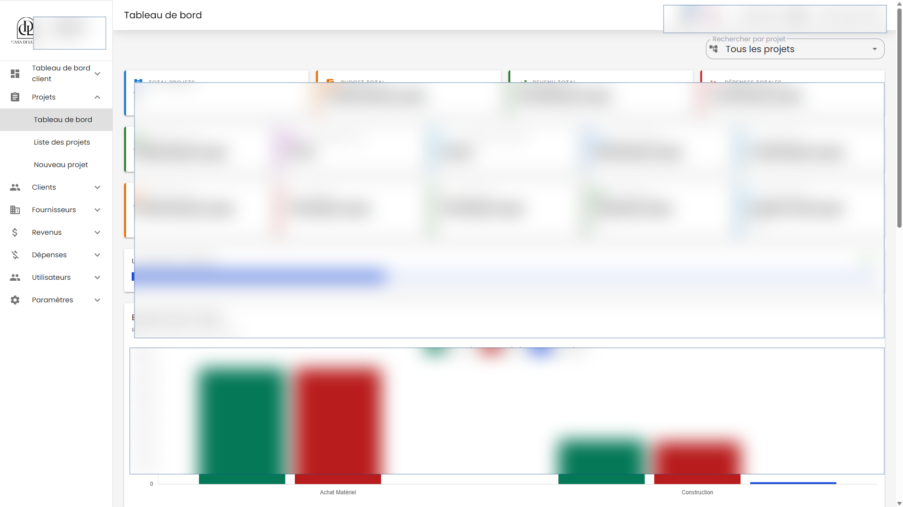
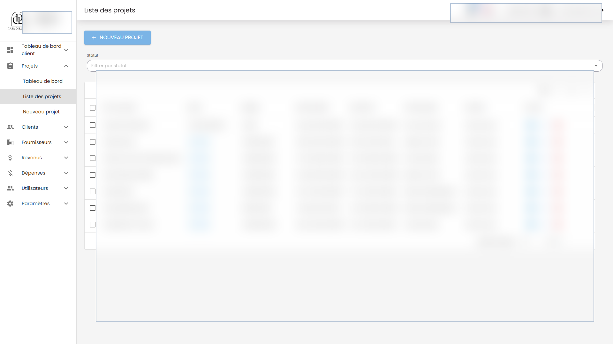

# Management Projet Frontend

Next.js interface for a project operations platform for clients, suppliers, projects, expenses, revenues, attachments, budgets, payment schedules, dashboards, notifications, and user management.

This frontend is built around real staff workflows: authenticated navigation, dense dashboards, tables, filters, create/edit/detail pages, forms, actions, settings, notifications, and production data constraints.

## What It Shows

- Product UI work for an internal business system.
- Data-heavy React/Next.js screens with real workflow depth.
- State management with Redux Toolkit and redux-saga.
- Authenticated app structure with NextAuth and API-backed routes.
- Form, table, dashboard, notification, and settings flows built for daily operations.

## Key Capabilities

- Next.js dashboard for projects, clients, suppliers, expenses, revenues, client dashboard, users, notifications, profile, and settings.
- MUI screens for project details, budget tracking, payment schedules, attachments, summary cards, filters, and entity CRUD controls.
- Redux Toolkit and redux-saga service flows for project operations, financial records, auth, notifications, and websocket state.
- Formik/Zod forms for projects, clients, suppliers, expenses, revenues, attachments, and users.
- Jest and Testing Library coverage for dashboards, forms, helpers, routes, store, and entity components.

## Stack

- Next.js 16, React 19, TypeScript
- NextAuth, Axios, React Redux
- Redux Toolkit, redux-saga
- MUI, MUI X Data Grid, Sass, chart components
- Formik, Zod, date-fns
- Jest, Testing Library, ts-jest, Bun

## Related Repository

- Backend API: [Altroo/management_projet_backend](https://github.com/Altroo/management_projet_backend)

## Screenshots

Redacted production screenshots. Sensitive names, amounts, dates, and records are blurred.





## Local Setup

Create local-only environment variables for the API base URL, auth settings, websocket endpoints, and public runtime config. Do not commit `.env` files or production credentials.

```bash
bun install
bun run dev
```

Default local port: `3003`.

## Quality Checks

```bash
bun x jest --runInBand --coverage=false
bun run lint
bun run build
```

## Portfolio Note

The repository is public for portfolio review. Screenshots are redacted, and sensitive production values are intentionally hidden.
