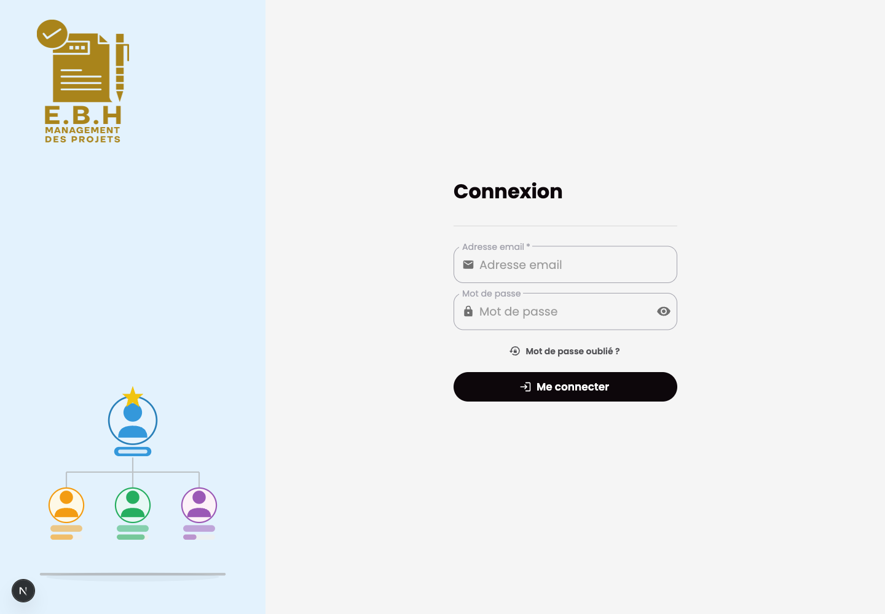

# Management Projet Frontend

## Purpose

Management Projet Frontend is the Next.js dashboard for project tracking, clients, suppliers, expenses, revenues, notifications, settings, and user administration.

## Stack

- Next.js and React
- TypeScript
- NextAuth
- Redux Toolkit and redux-saga
- MUI, Sass, and chart components
- Formik and Zod
- Jest and Testing Library

## Features

- Project, client, and supplier screens
- Expense and revenue workflows
- Dashboard and reporting views
- User administration and profile settings
- Notifications and maintenance status handling
- Localized interface text

## Setup

Provide local-only variables for the API, auth, and websocket endpoints. Use localhost values for local development and do not commit local configuration files.

```bash
bun install
bun run dev
```

The frontend runs on `localhost:3003`.

## Tests

```bash
bun x jest --runInBand --coverage=false
bun run lint
bun run build
```

## Screenshot


